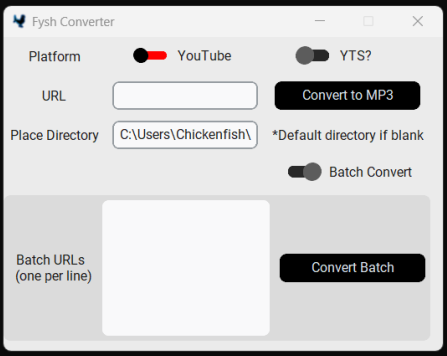

# **Fysh Converter**

## Install
&emsp; Run the newest release and then add a shortcut from your install location of the exe file to Windows Start Menu.

```
C:\ProgramData\Microsoft\Windows\Start Menu\Programs
```

## Description
&emsp; Fysh Converter is a lightweight tool for easy audio and video conversion from (primarily) YouTube and Spotify. It simplifies downloading and converting content from .webp or other non-MP3 formats, with the ability to process one or many links or descriptions at a time asynchronously.

## Features:
- **Platform Selection**: Toggle between YouTube and Spotify sources.
- **URL Input**: Paste the URL or write the song name of the audio you wish to download.
- **Directory Selection**: Set a custom download directory or use the default.
- **Batch Conversion**: Similar input as before but each line is treated as its own selection.





## Instructions:
1. **Single Conversion**:
   - Select the platform (e.g., YouTube).
   - Paste the URL/Description into the **URL** field.
        - To use a description for YouTube searches toggle "YTS?" to the ON position. Note this is not necessary for Spotify descriptive searches.
   - Specify a directory in **Place Directory**, or leave it blank to use the default.
   - Click **Convert to MP3**.

2. **Batch Conversion**:
   - Toggle **Batch Convert**.
   - Paste multiple URLs/Descriptions (one per line) into the **Batch URLs** box.
        - To use a description for YouTube searches toggle "YTS?" to the ON position. Note this is not necessary for Spotify descriptive searches.
   - Click **Convert Batch**.